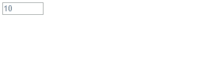

## `<form>` 폼 만들기

`<form>`태그는 폼을 만드는 가장 기본적인 태그로 `<form>`태그와 `</form>`태그사이에 여러 폼 요소와 관련된 태그를 넣습니다.

```html
<form [속성="속성 값"]>여러 폼요소</form> 
```

`<form>`에서 사용하는 속성들은 아래와 같습니다.

<table class="table">
    <thead>
        <tr>
            <th>속성</th>
            <th colspan="2">설명</th>
        </tr>
    </thead>
    <tbody>
        <tr>
            <th rowspan="3">method</th>
            <td colspan="2">사용자가 입력한 내용들을 서버쪽 프고르매으로 어떻게 넘겨줄지 지정합니다.</td>
        </tr>
        <tr>
            <td rowspan="2" width="50">속성값</td>
            <td>get - 주소 표시줄에 사용자가 입력한 내용이 그대도 드러납니다.</td>
        </tr>
        <tr>
            <td>post - 대부분 이 방식을 사용합니다. 사용자의 입력을 표준 입력으로 넘겨주기 때문에 입력 내용이 길이에 제한을 받지 않고 내용이 드러나지 않습니다.</td>
        </tr>
        <tr>
            <th>name</th>
            <td colspan="2">폼의 이름을 지정합니다. 한 문서 안에 여러 개의 `<form>`태그가 있을경우, 폼들을 구분하기 위해 사용합니다.</td>
        </tr>
        <tr>
            <th>action</th>
            <td colspan="2">`<form>`태그안의 내용들을 처리해 줄 서버 상의 프로그램을 지정합니다.</td>
        </tr>
        <tr>
            <th>target</th>
            <td colspan="2">`<action>`태그에서 지정한 스크립트 파일을 현재 창이 아닌 다른 위치에 열도록 지정합니다.</td>
        </tr>
    </tbody>
</table>


#### `<label>`

레이블(label)이란 입력 창 옆에 '아이디'나 '비밀번호'처럼 붙여 놓은 텍스트를 말합니다. 
`<label>`태그를 사용하면 폼 요소와 레이블 텍스트가 서로 연결되어 있다는 것을 브라우저가 알 수 있습니다.

```html
<!-- 기본형 -->
<label [속성="속성 값"]>레이블텍스트<input ....></label>

<!-- id 로 연결되어 있는경우 -->
<label for="id이름">
    <input id="id이름" [속성="속성 값"]>
</label>
```

> id이름은 유일해야하며, id이름이 있는 레이블과 input이 떨어져있어도 서로 연결되어 있으며, 화면낭독기도 그렇게 읽어줍니다.


###### 라디오버튼 체그박스와 사용하는 레이블

라디오버튼(radio)이나 체크박스(checkbox) 등은 레이블을 사용하지 않으면 클릭요소가 작아서 모바일에서는 불편합니다.

아래 예제의 경우 체크박스만 클릭을 해야 선택이 되어 집니다.

```html
<ul>
    <li><input type="checkbox">선택1</li>
    <li><input type="checkbox">선택2</li>
    <li><input type="checkbox">선택3</li>
</ul>
```

<ul>
    <li><input type="checkbox">선택1</li>
    <li><input type="checkbox">선택2</li>
    <li><input type="checkbox">선택3</li>
</ul>

하지만 레이블로 감싼경우 텍스트 영역 전체를 클릭해도 선택이 되어집니다.

```html
<ul>
    <li><label><input type="checkbox">선택1</label></li>
    <li><label><input type="checkbox">선택2</label></li>
    <li><label><input type="checkbox">선택3</label></li>
</ul>
```

<ul>
    <li><label><input type="checkbox">선택1</label></li>
    <li><label><input type="checkbox">선택2</label></li>
    <li><label><input type="checkbox">선택3</label></li>
</ul>


#### 폼요소 그룹으로 묶기

폼을 사용하다보면 폼 안에서 여러구역을 나누어 표시해야 할때가 있습니다. 이럴때 `<fieldset>`, `<legend>`태그를 사용합니다.    
`<fieldset>` 은 폼들을 하나의 그룹을 묶을때 사용하며 기본 스타일은 외곽선을 그려줍니다.    
`<legend>`는 묶은 그룹의 제목을 붙여 줍니다.

아래는 개인정보와 로그인정보 등으로 묶은 폼의 예입니다.

```html
<form>
    <fieldset>
        <legend>개인정보</legend>
        <ul>
            <li><label for="name">이름</label><input type="text" id="name"></li>
            <li><label for="mail">메일주소</label><input type="text" id="mail"></li>
        </ul>
    </fieldset>
    <fieldset>
        <legend>로그인정보</legend>
        <ul>
            <li><label for="id">아이디</label><input type="text" id="id"></li>
            <li><label for="pwd">비밀번호</label><input type="text" id="pwd"></li>
        </ul>
    </fieldset>
</form>
```

<form>
    <fieldset>
        <legend>개인정보</legend>
        <ul>
            <li><label for="name">이름</label><input type="text" id="name"></li>
            <li><label for="mail">메일주소</label><input type="text" id="mail"></li>
        </ul>
    </fieldset>
    <fieldset>
        <legend>로그인정보</legend>
        <ul>
            <li><label for="id">아이디</label><input type="text" id="id"></li>
            <li><label for="pwd">비밀번호</label><input type="text" id="pwd"></li>
        </ul>
    </fieldset>
</form>


<br>

## 사용자 입력을 위한 `<input>` 태그

`<input>`태그에 넣을 수 있는 항목은 아이디, 비번, 이메일, 전화번호, 날짜, 시간, 이미지, 버튼 등 다양합니다.
이것은 `type` 속성에 의해 결정됩니다.

기본형

```html
<input type="text">
```

'type`속성에 사용되는 유형은 아래와 같습니다.

<table class="table">
    <tr>
        <th>유형</th>
        <th>설명</th>
    </tr>
    <tr>
        <td>hidden</td>
        <td>한 줄 짜리 텍스트를 입력할 수 있는 텍스트 상자를 넣습니다.</td>
    </tr>
    <tr>
        <td>search</td>
        <td>검색 상자를 넣습니다.</td>
    </tr>
    <tr>
        <td>tel</td>
        <td>전화번호 입력 필드를 넣습니다.</td>
    </tr>
    <tr>
        <td>url</td>
        <td>URL 주소를 입력할 수 있는 필드를 넣습니다.</td>
    </tr>
    <tr>
        <td>email</td>
        <td>메일 주소를 입력할 수 있는 필드를 넣습니다.</td>
    </tr>
    <tr>
        <td>password</td>
        <td>비밀번호를 입력할 수 있는 필드를 넣습니다.</td>
    </tr>
    <tr>
        <td>datetime</td>
        <td>국제 표준시(UTC)로 설정된 날짜와 시간(연,월,일,시,분,초,분할 초)를 넣습니다.</td>
    </tr>
    <tr>
        <td>datetime-local</td>
        <td>사용자가 있는 지역을 기준으로 날짜와 시간(연,월,일,시,분,초,분할 초)를 넣습니다.</td>
    </tr>
    <tr>
        <td>date</td>
        <td>사용자 지역을 기준으로 날짜(연,월,일)를 넣습니다.</td>
    </tr>
    <tr>
        <td>month</td>
        <td>사용자 지역을 기준으로 날짜(연,월)를 넣습니다.</td>
    </tr>
    <tr>
        <td>week</td>
        <td>사용자 지역을 기준으로 날짜(연,주)를 넣습니다.</td>
    </tr>
    <tr>
        <td>time</td>
        <td>사용자 지역을 기준으로 시간(시,분,초,분할 초)을 넣습니다.</td>
    </tr>
    <tr>
        <td>number</td>
        <td>숫자를 조절할 수 있는 화살표를 넣습니다.</td>
    </tr>
    <tr>
        <td>range</td>
        <td>숫자를 조절할 수 있는 슬라이드 막대를 넣습니다.</td>
    </tr>
    <tr>
        <td>color</td>
        <td>색상표를 넣습니다.</td>
    </tr>
    <tr>
        <td>checkbox</td>
        <td>주어진 항목에서 2개 이상 선택 가능한 체크박스를 넣습니다.</td>
    </tr>
    <tr>
        <td>radio</td>
        <td>주어진 항목에서 1개만 선택할 수 있는 라디오 버튼을 넣습니다.</td>
    </tr>
    <tr>
        <td>file</td>
        <td>파일을 첨부할 수 있는 버튼을 넣습니다.</td>
    </tr>
    <tr>
        <td>submit</td>
        <td>서버 전송 버튼을 넣습니다.</td>
    </tr>
    <tr>
        <td>image</td>
        <td>submit 버튼 대신 사용할 이미지를 넣습니다.</td>
    </tr>
    <tr>
        <td>reset</td>
        <td>리셋 버튼을 넣습니다.</td>
    </tr>
    <tr>
        <td>button</td>
        <td>버튼을 넣습니다.</td>
    </tr>
</table>


> HTML5에서 새로 채택된 속성들은 브라우져마다 지원여부가 다릅니다. [http://caniuse.com](http://caniuse.com) 에 접속후 index of features 링크를 클릭하면 HTML5 항목에 대한 부분을 볼 수 있습니다. 예를들어 Date and time input types 를 클릭하면 지원하는 브라우져 버젼에 대해서 나옵니다. 빨강색은 미지원, 초록색은 지원, 녹색은 부분지원을 뜻합니다.


#### hidden 히든필드 만들기

히든(hidden) 필드는 화면상에는 보이지 않지만 사용자가 입력을 마치고 폼을 서버로 전송할때 함께 전송되는 요소입니다.
사용자에게는 굳이 보여주지 않고 관리자가 알아야 하는것을 히든 필드로 사용합니다.

```html
<input type="hidden" name="이름" value="서버로 넘길 값">
```

#### text 텍스트 필드 만들기

한줄짜리 일반 텍스트를 입력하는 필드입니다. 주로 아이디, 이름, 주소 등 텍스트를 입력할때 사용합니다.

```html
<input type="text" [속성="속성 값"]>
```

텍스트 필드에서 사용할 수 이쓴ㄴ 속성은 다음과 같습니다.

<table class="table">
    <tr>
        <th>속성</th>
        <th>설명</th>
    </tr>
    <tr>
        <td>name</td>
        <td>텍스트 필드를 구별할 수 있도록 이름을 붙입니다.</td>
    </tr>
    <tr>
        <td>size</td>
        <td>텍스트 필드의 길이를 숫자로 지정합니다.</td>
    </tr>
    <tr>
        <td>value</td>
        <td>텍스트 필드 요소가 화면에 표시될때 텍스트 필드 부분에 표시될 내용입니다.</td>
    </tr>
    <tr>
        <td>maxlength</td>
        <td>텍스트 필드에 입력할 수 있는 최대 문자 개수를 지정합니다.</td>
    </tr>
</table>


#### password 비빌번호 입력란 만들기

비밀번호 입력란을 만듭니다. 다른 필드와는 다르게 사용자가 입력하는 내용이 `*` 나 `.` 으로 표시됩니다.

```html
<input type="password" [속성="속성 값"]>
```


#### search, url, email, tel 분화된 텍스트 필드 

- search - 검색상자 만들기

텍스트 필드를 이용해서 검색할 때 사용합니다. 크롬이나 MS 엣지 브라우져등에서는 검색어를 입력하면 우측에 'x' 표시가 되어 검색어를 지울수 있습니다.

```html
<input type="search">
<input type"submit" value="검색">
```

- url - 입력란 만들기

텍스트 필드를 기반으로 웹주소를 입력할 때 사용합니다. 이 필드는 반드시 'http://'로 시작하는 사이트 주소를 입력해야 합니다.

```html
<input type="url" [속성="속성 값"]>
```


- email - 메일 주소 입력란 만들기

기존 HMTL에서는 이메일을 체크하려면 '@'문자가 있는지 체크했습니다. html5에서는 `type="email"` 로 지정하면 브라우저가 자동으로 메일형식에 맞는지 체크합니다.

```html
<input type="email" [속성="속성 값"]>
```

- tel - 전화번호 입력란 만들기

텍스트 필드 기반으로 전화번호를 입력할때 사용합니다. 모바일인경우 넘버 키패드가 바로 사용됩니다.

```html
<input type="tel" [속성="속성 값"]>
```

#### number  숫자 입력하기

사용자가 입력한 내용을 숫자로 인식합니다. 브라우저에 따라 스핀박스가 표시되기도 합니다.   
스핀박스란 입력창 오른쪽에 작은 화살표시를 말합니다. 이 화살표시는 숫자를 증가 또는 감소시킬수 있습니다.

```html
<input type="number" [속성="속성 값"]>
```

#### range 슬라이드 막대로 숫자 지정하기

슬라이드 막대를 움직여 숫자 값을 입력하게 할때 사용합니다. 슬라이더의 모습이 브라우저마다 다를수 있습니다.

```html
<input type="range" [속성="속성 값"]>
```

`type="number"`과 `type="range"`필드에서 사용할 수 있는 속성값은 다음과 같습니다.

<table class="table">
    <tr>
        <th>속성</th>
        <th>설명</th>
    </tr>
    <tr>
        <td>min</td>
        <td>필드에 입력할 수 있는 최솟값을 지정합니다. type="range"일때 최솟값은 0입니다.</td>
    </tr>
    <tr>
        <td>max</td>
        <td>플드에 입력할 수 있는 최댓값을 지정합니다. type="range"일때 최댓값은 100입니다.</td>
    </tr>
    <tr>
        <td>step</td>
        <td>짝수나 홀수 등 특정 숫자로 제한하려고 할 때 숫자 간격을 지정할 수 있습니다. 기본값은 1이며 생략가능합니다.</td>
    </tr>
    <tr>
        <td>value</td>
        <td>필드에 표시할 초기값입니다.</td>
    </tr>
</table>


#### radio, checkbox 라디오버튼과 체크박스 넣기

라디오버튼과 체크박스는 여러 항목중 원하는 항목을 선택할 때 사용하는 폼요소 입니다. 이때 하나만 선택할 경우 라디오버튼을 사용하며, 두개이상 다중선택을 할경우 체크박스를 사용합니다.

라디오버튼은 하나의 항목만 선택할 수 있으므로, 이미 선택되어 있는경우 다른 항목을 선택하면 현재의 항목은 취소됩니다.

라디오버튼과 체크박스에서 사용할 수 있는 속성은 다음과 같습니다.

<table class="table">
    <tr>
        <th>속성</th>
        <th>설명</th>
    </tr>
    <tr>
        <td>name</td>
        <td>라디오버튼이나 체크박스를 구분하기 위해 name 을 사용합니다. 라디오버튼의 경우 하나만 선택하는 것이기때문에 관련 그룹끼리는 같은 name 속성 값을 사용합니다.</td>
    </tr>
    <tr>
        <td>value</td>
        <td>선택한 라디오버튼이나 체크박스를 서버로 넘겨줄 값을 지정합니다. 이 값은 영문, 숫자이여야 하면 필수입니다.</td>
    </tr>
    <tr>
        <td>checked</td>
        <td>라디오버튼의 항목은 처음에는 아무것도 선택되지 않은 상태입니다. 기본으로 선택해 놓을 항목이 있다면 `checked` 속성을 사용합니다.</td>
    </tr>
</table>


#### color 색상 선택 상자 표시하기

color 필드는 색상표에서 사용자가 색상을 선택할 수 있게 해줍니다.   
색상값은 16진수로 표시하고 "red"나 "yellow"같은 색상이름은 사용할 수 없습니다.

```html
<input type="color" [value="기본 색" [속성="속성 값"]]>
<!-- 초록색이 기본일경우 -->
<input type="color" value="#00ff00">
```

> 데스트탑용 파이어폭스, 크롬, 오페라 브라우져와 안드로이드 브라우저에서만 지원하고 그외에서는 텍스트 필드로 표시됩니다.


#### date, month, week 날짜 표시하기

텍스트 필드에 날짜를 표시할때 사용합니다.

```html
<input type="date | month | week" [vlaue="기본 값" 속성="속성 값"]>
```

여기서 `|` 는 또는(or)을 뜻합니다. 

<table class="table">
    <tr>
        <th>속성</th>
        <th>설명</th>
    </tr>
    <tr>
        <td>date</td>
        <td>날짜를 선택했을때 'yyyy-mm-dd' 형식으로 연도, 월,일이 표시됩니다.</td>
    </tr>
    <tr>
        <td>month</td>
        <td>날짜를 선택했을때 'yyyy-mm' 형식으로 연도, 월이 표시됩니다.</td>
    </tr>
    <tr>
        <td>week</td>
        <td>날짜를 선택했을때 1월 첫째주를 기준으로 몇번째 주인지 연도와 주가 표시됩니다. 에를들어 24번째 주라면 "yyyy-W24" 형식으로 표시됩니다.</td>
    </tr>
</table>


#### time, datetime, datetime-local 시간 지정하기

시간을 지정할때 사용합니다.


```html
<input type="time | datetime | datetime-local" [value="기본 값" 속성="속성 값"]>
```

날짜나 시간과 관련된 유형을 지정할때 공통으로 사용하는 속성은 다음과 같습니다.

<table class="table">
    <tr>
        <th>속성</th>
        <th>설명</th>
    </tr>
    <tr>
        <td>min</td>
        <td>날짜나 시간의 최솟값을 지정합니다.</td>
    </tr>
    <tr>
        <td>max</td>
        <td>날짜나 시간의 최솟값을 지정합니다.</td>
    </tr>
    <tr>
        <td>step</td>
        <td>스핀박스의 화살표를 누를때마다 날짜나 시간을 얼마나 조절할지를 지정합니다.</td>
    </tr>
    <tr>
        <td>value</td>
        <td>화면에 표시할 초기값을 지정합니다.</td>
    </tr>
</table>


#### submit, reset 서버전송, 리셋버튼 넣기

리셋(reset)버튼은 `<input>`요소에 입력된 모든 정보를 재설정해 사용자가 입력한 내용을 모두 지울수 있습니다.
이때 value 속성을 사용해 버튼에 표시할 내용을 지정합니다.   
submit 버튼은 사용자가 폼에 입력한 정보를 서버로 전송하는 역활을 합니다.

```html
<input type"submit | reset" [value="버튼 내용"] [속성="속성 값"]>
```


#### image 이미지 버튼 넣기

`type="image"`를 사용하면 `submit` 버튼 대신 전송 이미지를 넣을 수 있습니다.

```html
<input type="image" src="이미지경로" alt="대체텍스트" [속성="속성 값"]>
```

#### button 버튼 넣기

폼 안에 버튼 형태를 만듭니다. 이 버튼은 `submit`이나 `reset`같은 자체 기능이 없고 오직 버튼만 넣기 때문에 스크립트 함수 등을 연결해 사용합니다.   
`value`속성을 사용해 버튼에 표시할 내용을 지정합니다.

```html
<input type="button" [value="버튼 내용"] [속성="속성 값"]>
```


#### file 파일 첨부 하기

`type="file"` 필드는 웹브라우저 화면에 [파일선택] 이나 [찾아보기] 등이 표시되는데 이 버튼을 클릭한 후 파일을 선택하면 파일이 첨부됩니다.

```html
<input type="file" [속성="속성 값"]>
```

다음 코드는 첨부 파일을 추가할 수 있는 요소인데 첨부 버튼은 웹브라우져마다 다를수 있습니다.

```html
<label>첨부파일<input type="file"></label>
```


<br>

## input 태그의 다양한 속성

입력란에 커서나 힌트를 표시하거나 필수로 입력해야 하는 필드를 지정하는등 좀더 세밀한 조정을 할 수 있습니다.

#### autofocus 입력 커서 표시하기

`autofocus` 속성을 사용하면 페이지를 불러오자마자 폼의 요소중에서 원하는 요소에 마우스 커서를 표시할 수 있습니다.   

이전에 이런 기능을 구현하려면 자바스크립트로 해야 했으나 HTML5에서는 `autofocus` 속성으로 간단히 할 수 있습니다.


```html
<label for="name">이름</label>
<input type="text" id="name" autofocus>
```


#### placeholder 힌트 표시하기

`placeholder` 속성은 텍스트필드에 힌트 내용을 표시합니다. 텍스트 필드에 내용을 입력하면 힌트는 사라지고 빈내용으로 포커스가 사라지면 힌트가 표시됩니다.

```html
<input type="text" placeholder="placeholder의 힌트">
```

<input type="text" placeholder="placeholder의 힌트">

#### readonly 읽기 전용 필드 만들기

`readonly` 속성은 사용자가 입력하지 못하고 읽게만 만드는 속성입니다.   
`readonly` 속성은 `true` 나 `false` 값을 사용하거나 `readonly` 만 사용할 수 있습니다.

```html
<input type="text" value="읽기전용" readonly>
```

<input type="text" value="읽기전용" readonly>


#### required 필수 필드 지정하기

내용을 폼에 입력한 후 submit 버튼을 클릭하면 폼을 서버로 전송하는데 이때 필수 필드에 필요한 내용이 모두 채워졌는지 검사해야 합니다. 
이렇게 필수적으로 입력해야 하는 내용에는 `required` 속성을 지정해 필수 필드로 만들 수 있습니다.   
require 속성은 `required="required"` 또는 `required` 라고만 입력하면 됩니다.

아무 내용도 입력하지 않고 버튼을 누르면 브라우저에서 체크해서 메시지를 표시합니다.   
이 메시지는 브라우저마다 다르게 표현될수 있습니다.

```html
<form>
    <input type="text" required>
    <button>button</button>
</form>
```


#### min, max, step 속성

`min` 속성과 `max` 속성은 각각 해당 필드의 최솟값과 최대값을 지정합니다.   
이때 한가지 속성만 지정할수도 있지만 두가지 속성을 같이 사용할 수도 있습니다.

`step` 속성은 허용된 범위내의 숫자의 일정한 간격을 가리킵니다.    
세가지 속성 모두 input 태그의 유형이 date, datetime, datetime-local, month, week, time, number, range 일 경우에만 사용할 수 있습니다.

```html
<input type="number" value="10" min="10" max="100" step="10">
```




#### size, minlength, maxlength 길이, 최소길이, 최대길이

`size` 속성은 텍스트 필드와 비밀번호 필드, 검색 필드 등 한줄짜리 텍스트와 관련된 필드에서 화면에 몇 글자까지 보이게 할지를 지정합니다.   
`maxlength` 속성은 사용자가 최대 몇 글자까지 입력할 수 있는지를 지정합니다.   
`minlength` 속성은 사용자가 최소 몇 글자이상을 입력할 수 있는지를 지정합니다.

```html
<input type="text" minlength="2" maxlength="6" size="4">
```

이외에도 `<input>` 태그에 사용할수 있는 속성들은 다음과 같습니다.


<table class="table">
    <tr>
        <th>속성</th>
        <th>설명</th>
    </tr>
    <tr>
        <td>formaction</td>
        <td>실행할 프로그램을 연결합니다. `type="submit"` 나 `type="image"`일때 사용할 수 있습니다.</td>
    </tr>
    <tr>
        <td>formenctype</td>
        <td>서버로 폼을 전송했을때 폼 데이터를 어떤 방식으로 해석할 것인지 지정합니다. `type="submit"` 나 `type="image"`일때 사용할 수 있습니다.</td>
    </tr>
    <tr>
        <td>formmethod</td>
        <td>서버로 폼을 전송하는 방식(get, post 등)을 지정합니다.</td>
    </tr>
    <tr>
        <td>formnovalidate</td>
        <td>`<form>`태그 안에 `novalidate`라는 속성이 있어서 서버로 전송할때 폼 데이터가 유효(validate)한지 여부를 표시할 수 있는데 `<input>`태그 안에서도 이 속성을 이용해 유효성 여부를 표시할 수 있습니다.</td>
    </tr>
    <tr>
        <td>formtaget</td>
        <td>폼 데이터를 서버로 전송한 후 서버의 응답을 어디에 표시할 것인지 타킷을 지정합니다.</td>
    </tr>
    <tr>
        <td>height, width</td>
        <td>`type="image"`일때 이미지의 높이, 너비를 지정합니다.</td>
    </tr>
    <tr>
        <td>list</td>
        <td>`<datalist>`에 미리 정의해 놓은 옵션 값을 `<input>` 안에 나열해 보여줍니다.</td>
    </tr>
    <tr>
        <td>multiple</td>
        <td>`type="email"`이나 `type="file"`일때 두개 이상의 값을 입력합니다. `<input>`태그안에 속성이름만 표시하면 됩니다.</td>
    </tr>
</table>


<br>


## 여러 데이터 나열해 보여주기

`<input>` 태그가 아닌 다른 태그를 사용해 여러 데이터를 나열해 보여주는 폼 요소들에 대해서 살펴보겠습니다.


#### 드롭다운 목록 만들기

드롭다운 목록이란 클릭했을때 옵션들이 요소 아래쪽으로 펼쳐지기 때문에 붙여진 이름입니다. 공간을 최소한으로 사용하면서 여러 옵션을 표시하는데 유용합니다.

드롭다운 목록은 `<select>`태그와 `<option>`태그를 이용해 표시합니다.   
`<select>`태그로 드롭다운 목록의 시작과 끝을 표시하고 그 안에 `<option>`태그를 사용해 원하는 항목들을 추가합니다.   
`<option>`태그의 `value` 속성을 이용해 서버로 넘겨주기 위한 값을 지정합니다.

```html
<select 속성="속성 값">
    <option value="값" [속성="속성 값"]>내용1</option>
    <option value="값" [속성="속성 값"]>내용2</option>
    <option value="값" [속성="속성 값"]>내용3</option>
</select>
```

<select 속성="속성 값">
    <option value="값">내용1</option>
    <option value="값">내용2</option>
    <option value="값">내용3</option>
</select>

`<select>` 태그의 속성은 아래와 같습니다.


<table class="table">
    <tr>
        <th>속성</th>
        <th>설명</th>
    </tr>
    <tr>
        <td>size</td>
        <td>화면에 표시될 드롭다운 메뉴의 항목 개수를 지정합니다.</td>
    </tr>
    <tr>
        <td>multiple</td>
        <td>브라우저 화면에 여러 개의 옵션이 함께 표시되면서 `ctrl`키를 누른 상태로 드롭다운 메뉴에 있는 여러 항목을 선택할 수 있습니다.</td>
    </tr>
</table>

아래는 4개까지 보이고 다중선택을 할 수 있는 예제 코드입니다.

```html
<select size="4" multiple>
    <option value="값">내용1</option>
    <option value="값">내용2</option>
    <option value="값">내용3</option>
    <option value="값">내용4</option>
    <option value="값">내용5</option>
    <option value="값">내용6</option>
    <option value="값">내용7</option>
</select>
```

<select size="4" multiple>
    <option value="값">내용1</option>
    <option value="값">내용2</option>
    <option value="값">내용3</option>
    <option value="값">내용4</option>
    <option value="값">내용5</option>
    <option value="값">내용6</option>
    <option value="값">내용7</option>
</select>


`<option>` 태그의 속성은 아래와 같습니다.

<table class="table">
    <tr>
        <th>속성</th>
        <th>설명</th>
    </tr>
    <tr>
        <td>value</td>
        <td>옵션을 선택했을때 서버로 넘겨질 값을 지정합니다.</td>
    </tr>
    <tr>
        <td>selected</td>
        <td>화면에 표시될 때 기본으로 선택되어 있는 옵션을 지정합니다.</td>
    </tr>
</table>


- 옵션끼리 묶기

드롭다운 목록에서 여러 항목들을 몇 가지 그룹으로 묶어야 할 경우 `<optgroup>`태그를 사용할 수 있습니다.   
`<optgroup>`태그를 사용할때는 `label` 속성을 사용해 그룹의 제목을 붙입니다.

```html
<select>
    <optgroup label="group1">
        <option>내용1</option>
        <option>내용2</option>
        <option>내용3</option>
    </optgroup>
    <optgroup label="group2">
        <option>내용1</option>
        <option>내용2</option>
        <option>내용3</option>
    </optgroup>
</select>
```

<select>
    <optgroup label="group1">
        <option>내용1</option>
        <option>내용2</option>
        <option>내용3</option>
    </optgroup>
    <optgroup label="group2">
        <option>내용1</option>
        <option>내용2</option>
        <option>내용3</option>
    </optgroup>
</select>


#### `<datalist>` 태그

드롭다운 목록에서 `<select>`태그 대신 `<datalist>`태그를 사용하면 데이터 목록중에서 값을 선택하도록 만들 수 있습니다.   
텍스트 필드에 값을 직접 입력하는것이 아니라 데이터 목록에서 선택하면 자동으로 입력되어 집니다.   
데이터 목록은 텍스트필드와 함께 사용하기 때문에 `<input>` 태그와 함께 사용합니다.   
`<input>`태그의 `list` 속성값과 데이터 목록의 `id`를 같게 만듭니다.

```html
<input type="text" list="choices">
<datalist id="choices">
    <option>내용1</option>
    <option>내용2</option>
    <option>내용3</option>
</datalist>
```

<input type="text" list="choices">
<datalist id="choices">
    <option>내용1</option>
    <option>내용2</option>
    <option>내용3</option>
</datalist>


`<option>` 태그의 속성은 아래와 같습니다.

<table class="table">
    <tr>
        <th>속성</th>
        <th>설명</th>
    </tr>
    <tr>
        <td>value</td>
        <td>사용자가 레이블을 선택했을때 서버로 넘겨질 값을 지정합니다.</td>
    </tr>
    <tr>
        <td>label</td>
        <td>사용자를 위해 브라우저에 표시할 레이블입니다. 따로 지정하지 않을경우, `value`값을 레이블로 사용합니다.</td>
    </tr>
</table>


#### 여러 줄 입력하는 텍스트 영역 만들기

폼에서 한 줄 이상의 문장을 사용할때 `<textarea>`태그를 사용하며 너비와 몇줄을 표시할지를 속성으로 표시할 수 있습니다.

<table class="table">
    <tr>
        <th>속성</th>
        <th>설명</th>
    </tr>
    <tr>
        <td>name</td>
        <td>다른 폼 요소와 구분하기 위해 텍스트 영역의 이름을 지정합니다.</td>
    </tr>
    <tr>
        <td>cols</td>
        <td>텍스트 영역의 가로 너비를 문자 단위로 지정합니다.</td>
    </tr>
    <tr>
        <td>rows</td>
        <td>텍스트 영역의 세로 길이를 줄 단위로 지정합니다. 지정한 숫자보다 줄 개수가 많아지면 스크롤 막대가 생깁니다.</td>
    </tr>
</table>

```html
<textarea name="name1" cols="30" rows="3"></textarea>
```

`col="30"` 인 경우 영문 또는 숫자 30자 미만까지 입력할 수 있습니다.

<textarea name="name1" cols="30" rows="3" placeholder="123456789012345678901234567890"></textarea>

<br>

## 기타 다양한 폼 요소들

폼에서 사용할 수 있는 다양한 요소들을 살펴봅니다.

#### button

`<button>`태그를 사용하여 폼의 내용을 전송하거나 리셋 등을 할 수 있습니다.

```html
<button [type="submit | reset | button"]>내용</button>
```


<table class="table">
    <tr>
        <th>속성 값</th>
        <th>설명</th>
    </tr>
    <tr>
        <td>submit</td>
        <td>폼을 서버로 전송합니다. `<button type="submit">전송</button>` 과 같이 사용합니다.</td>
    </tr>
    <tr>
        <td>reset</td>
        <td>폼에 입력한 내용을 초기화 시킵니다. `<button type="reset">다시쓰기</button>` 과 같이 사용합니다.</td>
    </tr>
    <tr>
        <td>button</td>
        <td>버튼 형태만 만들 뿐 자체 기능은 없습니다. `<button type="button">주소입력</button>` 과 같이 사용합니다.</td>
    </tr>
</table>

`<button>`태그에 에 사용된 submit, reset, button 유형은 `<input>`태그에도 동일하게 사용할 수 있습니다.   
차이점은 버튼의경우 화면낭독기에서 버튼이 있다고 명시적으로 알수 있고 콘텐츠를 포함할 수 있다는 점입니다.

```html
<form>
    <button type="button">
         전송하기
    </button>
</form>
```

<form>
    <button type="button">
         전송하기
    </button>
</form>


#### progress

`<progress>` 태그는 작업 진행 상태를 나타낼 때 사용합니다.   
작업 시작을 0으로 하고 최종 완료를 최댓값으로 해 얼마나 진척되었는지 숫자로 표현합니다. 이때 사용하는 값에는 특별한 단위가 없고 단위를 표시하지도 않습니다.

```html
<progress value="값" [max="값"]></progress>
```

`<progress>` 태그에서 사용할 수 있는 속성은 아래와 같습니다.

<table class="table">
    <tr>
        <th>속성</th>
        <th>설명</th>
    </tr>
    <tr>
        <td>value</td>
        <td>작업 진행 상태를 나타내며 부동 소수점으로 표현합니다. 이 값은 0보다 크거나 같고 max 값보다 작거나 같아야 합니다.</td>
    </tr>
    <tr>
        <td>max</td>
        <td>작업이 완료되려면 얼마나 많은 작업을 해야하는지 부동 소수점으로 표현합니다. 이 값은 0보다 커야합니다.</td>
    </tr>
</table>


아래 예제처럼 최대 100중에서 50% 진행한 상태를 보여줍니다.   
표시한것은 브라우저마다 다르게 보여질 수 있습니다.

```html
<label>50% 진행
    <progress value="50" max="100"></progress>
</label>
```

<label>50% 진행
    <progress value="50" max="100"></progress>
</label>


#### meter

`<meter>` 태그는 전체 크기중에서 얼마나 차지하는지를 표현할때 사용합니다.   
`<progress>` 태그는 진행상태를 나타낸다면 `<meter>` 태그는 지정된 범위내에서 해당 값만큼 차지하는지를 표시합니다.

```html
<meter value="값" [속성="속성 값"]></meter>
```

`<meter>` 태그에서 사용하는 속성은 다음과 같습니다.

<table class="table">
    <tr>
        <th>속성</th>
        <th>설명</th>
    </tr>
    <tr>
        <td>min, max</td>
        <td>범위의 최솟값, 최댓갑을 나타냅니다. 지정하지 않으면 0과 1로 간주합니다.</td>
    </tr>
    <tr>
        <td>value</td>
        <td>범위 내에서 차지하는 값을 나타냅니다.</td>
    </tr>
    <tr>
        <td>low</td>
        <td>"이 정도면 낮다"라고 할 정도의 값을 지정합니다.</td>
    </tr>
    <tr>
        <td>height</td>
        <td>"이 정도면 높다"라고 할 정도의 값을 지정합니다.</td>
    </tr>
    <tr>
        <td>optimum</td>
        <td>"이 정도면 적당하다"라고 할 정도의 범위을 지정합니다.</td>
    </tr>
</table>


```html
<label>68% 차지함
    <meter value="68" min="0" max="100"></meter>
</label>
```

<label>68% 차지함
    <meter value="68" min="0" max="100"></meter>
</label>


