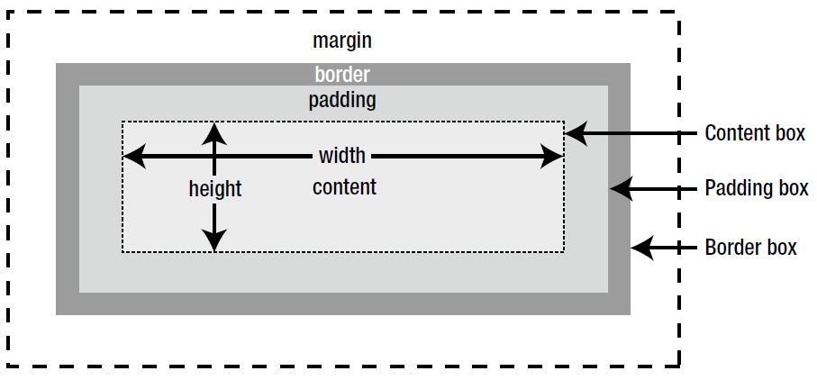

## 웹에서 색상 표현하기

색상이름은 [140 개이상](https://www.w3schools.com/colors/colors_names.asp)을 지원합니다.

색상값은 HEX, RGB(RGBA), HSL(HSLA)를 사용하여 지정할 수 있습니다.

#### 16 진수 표기법(HEX)

`#ffff00` 처럼 `#` 기호에 6 자리 16 진수로 표시하는 방법입니다. 이 6 자리는 두자리씩 묶어 #RRGGBB 형식으로 표시합니다.

rr(빨강), gg(녹색), bb(파랑)는 00(색이 하나도 섞이지 않음)에서 ff(색이 가득 섞임) 사이의 16 진수값입니다.

<table class="table">
    <tr>
        <th>십진수</th>
        <td>0</td>
        <td>1</td>
        <td>2</td>
        <td>3</td>
        <td>4</td>
        <td>5</td>
        <td>6</td>
        <td>7</td>
        <td>8</td>
        <td>9</td>
        <td>10</td>
        <td>11</td>
        <td>12</td>
        <td>13</td>
        <td>14</td>
        <td>15</td>
    </tr>
    <tr>
        <th>16진수</th>
        <td>0</td>
        <td>1</td>
        <td>2</td>
        <td>3</td>
        <td>4</td>
        <td>5</td>
        <td>6</td>
        <td>7</td>
        <td>8</td>
        <td>9</td>
        <td>a</td>
        <td>b</td>
        <td>c</td>
        <td>d</td>
        <td>e</td>
        <td>f</td>
    </tr>
</table>

> #ffff00 처럼 두 자리씩 중복될경우 #ff0 으로 줄여서 표기할 수도 있습니다.

#### rgb 와 rgba 표기법

0(하나도 섞이지 않음)~255(가득 섞임) 사이의 값을 사용하여 십진수로 표시합니다.

끝에 a 는 불투명도(alpha) 값을 나타내며 0 부터 1 까지의 값중에서 사용하며, 0 은 완전투명 1 은 불투명으로 사이값으로 0.5, 0.6 또는 .6 형식으로 지정할 수도 있습니다.

```css
rgb(red 값, green 값, blue 값)
rgba(red 값, green 값, blue 값, alpha 값)
```

아래 예제는 빨강색으로 불투명도는 0.5 입니다.

```css
p {
  color: rgba(155, 0, 0, 0.5);
}
```

#### hsl 과 hsla 표기법

hsl 은 색조(hue), 채도(saturation), 명도(lightness) 를 나타냅니다.

```css
hsl(hue 값, saturation 값, lightness 값)
hsla(hue 값, saturation 값, lightness 값, alpha 값)
```

색상(hue)은 0 과 360 도는 빨강색, 120 도는 초록색, 240 도는 파란색이 배치되고 사이사이 나머지 색들이 배치됩니다.

채도(saturation)는 '%'로 표시되고 아무것도 섞이지 않은 상태가 채도가 가장 높은 상태입니다. 채도가 0%이면 회색 톤, 100%이면 순색으로 표시됩니다.

명도(lightness)도 '%'로 표시되고 0%가 가장 어둡고 100%가 가장 밝습니다.


아래 예제는 발강색을 표현하는데 알파값이 0.5 로 절반쯤 투명합니다.

```css
p {
  color: hsla(360, 100%, 0%, 0.5);
}
```

<br>

## 배경색과 배경이미지

웹문서 전체에 배경뿐만이 아니라 텍스트, 목록 등 원하는 부분에도 배경을 지정할 수 있습니다. 배경 색뿐만이 아니라 이미지도 넣을 수 있습니다.

#### 배경색 지정하기

배경 색을 지정하려면 `background-color` 속성을 사용합니다.

```css
background-color: <색상>;
```

`background-color` 의 값으로 16 진수, rbg 값, 색상이름 등을 사용할 수 있습니다.

> background-color 는 상속되지 않습니다.

#### 배경 적용 범위 조절하기

배경의 적용 범위를 지정하는 것은 `background-clip` 속성을 사용합니다.

```css
background-clip: border-box | padding-box | content-box;
```

이 속성에서 사용할 수 있는 값은 아래와 같습니다.

<table class="table">
    <tr>
        <th>속성 값</th>
        <th>설명</th>
    </tr>
    <tr>
        <td>border-box</td>
        <td>박스 모델의 가장 외곽인 테두리(border)까지 적용합니다.</td>
    </tr>
    <tr>
        <td>padding-box</td>
        <td>박스 모델에서 테두리를 뺀 패딩(padding) 범위까지 적용합니다.</td>
    </tr>
    <tr>
        <td>content-box</td>
        <td>박스 모델에서 내용(centent) 부분에만 적용합니다.</td>
    </tr>
</table>


박스 모델이란 웹요소 형태를 박스 형태로 인식하고 테두리와 여백, 요소 사이의 간격 등을 계산하고 배치하는 방법을 말합니다.



#### 웹요소에 배경 이미지 넣기

배경 이미지를 넣을 때는 `background-image` 속성을 사용합니다.

```css
background-image: url(파일경로);
```

url 에 파일경로는 파일명까지 포함해야 하며, 상대경로 또는 절대경로 다 사용가능합니다.

파일경로에는 작은따옴표(또는 큰따옴표)를 붙여도되고, 생략해도 됩니다.

배경이미지를 여러 개를 사용할 수 있는데 이때는 첫번째 이미지부터 순서대로 보여집니다.

##### 배경 이미지 반복 방법 지정하기

배경 이미지를 반복해서 표시할지를 지정하며 `background-repeat` 속성을 사용하여 지정합니다.

```css
background-repeat: repeat | repeat-x | repeat-y no-repeat;
```

속성값은 다음과 같습니다.

<table class="table">
    <tr>
        <th>속성 값</th>
        <th>설명</th>
    </tr>
    <tr>
        <td>repeat</td>
        <td>배경이미지를 가로와 세로로 반복합니다.</td>
    </tr>
    <tr>
        <td>repeat-x</td>
        <td>배경이미지를 가로로 반복합니다.</td>
    </tr>
    <tr>
        <td>repeat-y</td>
        <td>배경이미지를 세로로 반복합니다.</td>
    </tr>
    <tr>
        <td>no-repeat</td>
        <td>배경이미지를 한번만 표시하고 반복하지 않습니다.</td>
    </tr>
</table>


#### 배경 이미지 크기 조절하기

배경 이미지를 여러가지 크기로 조절할수 있으며 `background-size` 속성을 사용합니다.

```css
background-size: auto | contain | cover | <크기값> | <백분율>;
```

속성 값은 다음과 같습니다.

<table class="table">
    <tr>
        <th>속성 값</th>
        <th>설명</th>
    </tr>
    <tr>
        <td>auto</td>
        <td>원래 배경 이미지 크기만큼 표시합니다.</td>
    </tr>
    <tr>
        <td>contain</td>
        <td>요소안에 이미지가 다 들어오도록 이미지를 확대/축소 합니다.</td>
    </tr>
    <tr>
        <td>cover</td>
        <td>배경 이미지로 요소를 모두 덮도록 이미지를 확대/축소 합니다.</td>
    </tr>
    <tr>
        <td>크기값</td>
        <td>너비 높이를 지정합니다. 너비만 지정할경우 원래 이미지 크기를 기준으로 확대/축소 비율을 자동으로 계산해 높이를 표시합니다.</td>
    </tr>
    <tr>
        <td>백분율</td>
        <td>요소를 기준으로 백분율로 값을 지정합니다.</td>
    </tr>
</table>


### 배경 이미지 위치 조절하기

배경 이미지의 위치는 `background-position` 속성을 이용해서 조절합니다.

```css
backgrond-position: <수평위치> <수직위치>;
```

- 수평위치: left | center | right | <백분율> | <길이 값>
- 수직위치: top | center | bottom | <백분율> | <길이 값>

`background-position` 속성은 수평위치, 수직위치를 같이 사용하는데 하나만 지정할경우, 그 값은 수평위치값으로 간주하고 수직 위치 값은 50%나 center 로 간주합니다.

- 키워드 표기법

배경 이미지의 위치를 지정할때 가장 많이 사용하는 속성값은 키워드입니다.
수평 수직의 값을 키워드로 지정합니다.
예를들어 `background-position: left bottom` 이런식으로 사용할 수 있습니다.

- 백분율(%) 표기법

수평 수직의 값을 %로 지정합니다.
예들들어 `background-position: 30% 60%` 라고 하면 왼쪽 모서리로부터 가로 30%, 세로 60%의 위치에 맞춥니다.

- 길이(px) 표기법

수평 수직의 값을 px 로 지정합니다.
예를들어 `background-position: 30px 20px` 라고 하면 왼쪽 모서리로부터 30px, 세로로 20px 의 위치에 맞춥니다.


### 배경 이미지 배치할 기준 조절하기

배경 이미지를 배치할 기준은 `background-origin` 속성으로 지정합니다.

```css
background-origin: border-box | padding-box | content-box;
```

<table class="table">
    <tr>
        <th>속성 값</th>
        <th>설명</th>
    </tr>
    <tr>
        <td>border-box</td>
        <td>박스 모델의 가장 외곽인 테두리(border)가 기준이 됩니다.</td>
    </tr>
    <tr>
        <td>padding-box</td>
        <td>박스 모델에서 테두리를 뺀 패딩(padding)이 기준이 됩니다.</td>
    </tr>
    <tr>
        <td>content-box</td>
        <td>박스 모델에서 내용 부분이 기준이 됩니다.</td>
    </tr>
</table>


### 배경 이미지 고정하기

스크롤할때 배경이미지를 고정할 수 있습니다. `background-attachment` 속성을 사용합니다.

<table class="table">
    <tr>
        <th>속성 값</th>
        <th>설명</th>
    </tr>
    <tr>
        <td>scroll</td>
        <td>화면 스크롤과 함께 배경 이미지도 스크롤됩니다. 기본값</td>
    </tr>
    <tr>
        <td>fixed</td>
        <td>화면이 스크롤되더라도 배경 이미지는 고정됩니다.</td>
    </tr>
</table>


### 배경 이미지 속성 하나로 제어하기

위에 설명한 배경 이미지 관련 속성을 `background` 속성 하나로 줄여서 사용할 수 있습니다.

```css
background: url("images/img.jpg") no-repeat fixed right bottom;
```

<table class="table">
    <tr>
        <th>속성</th>
        <th>속성 값</th>
    </tr>
    <tr>
        <td>background-image</td>
        <td>url('images/img.jpg')</td>
    </tr>
    <tr>
        <td>background-repeat</td>
        <td>no-repeat</td>
    </tr>
    <tr>
        <td>background-attachment</td>
        <td>fixed</td>
    </tr>
    <tr>
        <td>background-position</td>
        <td>right bottom</td>
    </tr>
    <tr>
        <td>background-clip</td>
        <td>border-box</td>
    </tr>
    <tr>
        <td>background-origin</td>
        <td>padding-box</td>
    </tr>
    <tr>
        <td>background-size</td>
        <td>auto</td>
    </tr>
</table>

> 별다른 속성 값을 지정하지 않으면 기본 값으로 지정됩니다.

## 그라데이션 효과로 배경 꾸미기

CSS3 에서는 색상 그라데이션(gradation)를 사용해 배경을 꾸밀 수도 있습니다. 선형이나 원형 그라데이션을 사용할때 브라우져를 고려해야하지만 유용한 기능입니다.

모던 브라우져 초기버젼에서는 접두사를 붙여야만 지원함으로 각 브라우져별로 속성을 지정하고 마지막에 표준 구문을 작성합니다.

<table class="table">
    <tr>
        <th>접두사</th>
        <th>브라우저 버젼</th>
    </tr>
    <tr>
        <td>-webkit-</td>
        <td>사파리, 크롬</td>
    </tr>
    <tr>
        <td>-moz-</td>
        <td>파이어폭스</td>
    </tr>
    <tr>
        <td>-o-</td>
        <td>오페라</td>
    </tr>
</table>

브라우져별 접두사를 적용한 예:

```css
.grad {
  background: blue; /* 그라데이션을 지원하지 않는 브라우져용 */
  background: -webkit-linear-gradient(left top, blue, white);
  background: -moz-linear-gradient(right bottom, blue, white);
  background: -o-linear-gradient(right bottom, blue, white);
  background: linear-gradient(to right bottom, blue, white); /* 표준구문 */
}
```

#### 선형 그라데이션

선형 그라데이션은 색상이 수직, 수평 또는 대각선 방향으로 일정하게 변하는 것을 말합니다.

```css
linear-gradient( [각도 | to 방향,]? color-stop [, color-stop])
```

###### 방향

그라데이션 방향을 지시할 때는 끝 지점을 기준으로 `to` 키워드와 함께 사용합니다.
선형 그라데이션의 위치나 각도 옵션을 생략하면 `to bottom`으로 인식합니다.

<table class="table">
    <tr>
        <th>속성 값</th>
        <th>설명</th>
    </tr>
    <tr>
        <td>to top</td>
        <td>아래에서 시작해 위로 만들어집니다.</td>
    </tr>
    <tr>
        <td>to left</td>
        <td>오른쪽에서 시작해 왼쪽으로 만들어집니다.</td>
    </tr>
    <tr>
        <td>to right</td>
        <td>왼쪽에서 시작해 오른쪽으로 만들어집니다.</td>
    </tr>
    <tr>
        <td>to bottom</td>
        <td>위에서 시작해 아래로 만들어집니다.</td>
    </tr>
</table>

브라우져별 지원방식이 약간 달라 주의해서 사용해야 합니다.

<table class="table">
    <tr>
        <th>접두사</th>
        <th>브라우저 버젼</th>
        <th>위치 속성 값</th>
    </tr>
    <tr>
        <td>-webkit-</td>
        <td>사파리 5.1 ~ 6.0</td>
        <td>그라데이션 시작위치 기준</td>
    </tr>
    <tr>
        <td>-moz-</td>
        <td>파이어폭스 3.6 ~ 15</td>
        <td>그라데이션 끝 위치 기준, to 키워드 사용하지 않음</td>
    </tr>
    <tr>
        <td>-o-</td>
        <td>오페라 11.1 ~ 12.0</td>
        <td>그라데이션 끝 위치 기준, to 키워드 사용하지 않음</td>
    </tr>
</table>

아래 예는 왼쪽 위에서 파란색으로 시작해 오른쪽 아래에서 흰색으로 변하는 그라데이션을 정의한 겁니다.

```css
.ex {
  background: blue;
  background: -webkit-linear-gradient(left top, blue, white);
  background: -moz-linear-gradient(bottom right, blue, white);
  background: -o-linear-gradient(bottom right, blue, white);
  background: linear-gradient(to bottom right, blue, white);
}
```

<div style="height:200px; background:blue; background:-webkit-linear-gradient(left top, blue, white); background:-moz-linear-gradient(bottom right, blue, white);
background:-o-linear-gradient(bottom right, blue, white);
background:linear-gradient(to bottom right, blue, white);"></div>


###### 각도

선형 그라데이션에서 색상이 바뀌는 방향을 알려주는 방법으로 각도를 사용할 수 있습니다.
이때의 각도는 그라데이션이 끝나는 각도이며, `deg` 단위를 써서 표시합니다.

맨 위부분이 `0deg`이고 시계 방향으로 회전하면서 `90deg, 180deg, 270deg` 등이 됩니다.
예를들어 `45deg` 는 오른쪽 위 방향이므로 왼쪽 아래에서 오른쪽 위로 끝납니다.


아래 예제는 왼쪽 아래에서 오른쪽 위로 변하고, 빨간색에서 흰색으로 변하는 선형 그라데이션을 정의한겁니다.

```css
.ex {
  height: 200px;
  background: #ff0000;
  background: -webkit-linear-gradient(45deg, #ff0000, #ffffff);
  background: -moz-linear-gradient(45deg, #ff0000, #ffffff);
  background: -o-linear-gradient(45deg, #ff0000, #ffffff);
  background: linear-gradient(to 45deg, #ff0000, #ffffff);
}
```

<div style="height:200px; background:#ff0000; background:-webkit-linear-gradient(45deg, #ff0000, #ffffff); background:-moz-linear-gradient(45deg, #ff0000, #ffffff);
background:-o-linear-gradient(45deg, #ff0000, #ffffff);
background:linear-gradient(to 45deg, #ff0000, #ffffff);"></div>


###### 색상 중지 점(color-stop)

선형 그라데이션을 만들기 위해서는 바뀌는 부분의 색을 지정해줘야 하는데 그 지점을 색상 중지 점(color-stop) 라고 합니다.
색상 중지 점을 지정할때는 색상만 지정할수도 있고, 색상과 중지 점의 위치도 같이 지정 할수도 있습니다.

다음 예는 시작색상과 끝색상을 #06f 로 하고 시작위치에서 30% 지점에 흰색을 두어 위에서 아래로 부드럽게 연결되는 그라데이션을 정의한 것입니다.

<div style="height: 200px; background: #06f; background-image: -webkit-linear-gradient(top, #06f, white 30%, #06f); background-image: -moz-linear-gradient(bottom, #06f, white 30%, #06f); background: -o-linear-gradient(bottom, #06f, white 30%, #06f); background: linear-gradient(to bottom, #06f, white 30%, #06f);"></div>

코드 예:

```css
.ex {
    height: 200px;
    background-image: -webkit-linear-gradient(top, #06f, white 30%, #06f);
    background-image: -moz-linear-gradient(bottom, #06f, white 30%, #06f); 
    background: -o-linear-gradient(bottom, #06f, white 30%, #06f); 
    background: linear-gradient(to bottom, #06f, white 30%, #06f);
}
```


#### 원형 그라데이션

원형 그라데이션은 원이나 타원의 주심부터 바깥 방향으로 색상이 바뀌는 형태입니다.
원의 중심과 크기를 지정하고 그라데이션의 모양을 지정해야 합니다.

```css
radial-gradient( <최종모양> <크기> at <위치>, color-stop, [color-stop]);
```

###### 모양

원형 그라데이션에서 모양은 circle(원형)과 ellipse(타원형) 입니다.
따로 지정하지 않으면 ellipse로 인식합니다.

아래 예는 circle로 정의한 경우입니다.

```css
.ex {
    height: 200px;
    width: 200px;
    background: red; 
    background: -webkit-radial-gradient(circle, white, yellow, red); 
    background: -moz-radial-gradient(circle, white, yellow, red); 
    background: -o-radial-gradient(circle, white, yellow, red); 
    background: radial-gradient(circle, white, yellow, red);
}
```

<div style="height: 200px; width: 200px; background: red; background: -webkit-radial-gradient(circle, white, yellow, red); background: -moz-radial-gradient(circle, white, yellow, red); background: -o-radial-gradient(circle, white, yellow, red); background: radial-gradient(circle, white, yellow, red);"></div>

###### 위치

표준 구문에서는 `모양`과 `크기` 속성 다음에 `at` 키워드와 함께 위치값을 지정하는데 브라우져 접두사를 붙이는 구문에서는 `at` 키워드 없이 구문의 맨 앞부분에 위치를 표시합니다.

사용할 수 있는 위치값은 키워드(left, center, right 중 하나, top, center, bottom 중 하나)나 30% 와 같은 백분율입니다.
생략하면 가로 세로 모두 중앙인 center 로 인식합니다.

10% 10% 위치에서 흰색에서 파란색으로 변하는 원형 그라데이션을 정의한 겁니다.

```css
.ex {
    height: 200px;
    width: 200px;
    background: blue; /* css 미지원 브라우저 */
    background: -webkit-radial-gradient(10% 10%, circle, white, blue); /* 초기 모던 브라우저 */
    background: -moz-radial-gradient(10% 10%, circle, white, blue); /* 초기 모던 브라우저 */
    background: -o-radial-gradient(10% 10%, circle, white, blue); /* 초기 모던 브라우저 */
    background: radial-gradient(circle at 10% 10%, white, blue); /* 최신 모던 브라우저 */
}
```

<div style="height: 200px; width: 200px; background: blue; background: -webkit-radial-gradient(10% 10%, circle, white, blue); background: -moz-radial-gradient(10% 10%, circle, white, blue); background: -o-radial-gradient(10% 10%, circle, white, blue); background: radial-gradient(circle at 10% 10%, white, blue);"></div>

###### 크기

원의 모양을 나타내는 키워드 값(circle 또는 elipse)과 크기를 나타내는 키워드 값을 같이 사용하면 됩니다.

* closest-side 속성 값

이 속성값을 사용하면 원의 경우, 그라데이션 가장자리가 중심에서 가장 가까운 요소의 모서리와 만나고, 타원의 경우, 중심에서 가장 가까운 요소의 수평축이나 수직축과 만납니다.

<div style="height: 150px; width:150px; background: radial-gradient(closest-side at 60% 55%,blue,green,yellow,black);"></div>


```css
.ex {
    height: 150px; 
    width:150px; 
    background: radial-gradient(closest-side at 60% 55%,blue,green,yellow,black);
}
```

* farthest-side 속성 값

그라데이션 가장자리가 중심에서 가장 먼 모서리와 만납니다.

<div style="height: 150px; width:150px; background: radial-gradient(farthest-side at 60% 55%,blue,green,yellow,black);"></div>


```css
.ex {
    height: 150px; 
    width:150px; 
    background: radial-gradient(farthest-side at 60% 55%,blue,green,yellow,black);
}
```

* closest-corner 속성 값

그라데이션 가장자리가 그라데이션 중심에서 가장 가까운 요소의 코너에 닿도록 합니다.

<div style="height: 150px; width:150px; background: radial-gradient(closest-corner at 60% 55%,blue,green,yellow,black);"></div>


```css
.ex {
    height: 150px; 
    width:150px; 
    background: radial-gradient(closest-corner at 60% 55%,blue,green,yellow,black);
}
```


* farthest-corner 속성 값(기본 값)

그라데이션 가장자리가 중심에서 가장 먼 코너에 닿도록 합니다.

<div style="height: 150px; width:150px; background: radial-gradient(farthest-corner at 60% 55%,blue,green,yellow,black);"></div>

```css
.ex {
    height: 150px; 
    width:150px; 
    background: radial-gradient(farthest-corner at 60% 55%,blue,green,yellow,black);
}
```

###### 색상 중지 점(color-stop)

선형 그라데이션처럼 원형 그라데이션에서 색상이 바뀌는 부분을 색상 중지 점(color-stop)이라고 하는데 색상뿐만 아니라 바뀌는 위치도 함께 지정할 수 있습니다.

다음 예제는 중앙에서 시작해 시작 색상은 빨간색이고 노란색을 거쳐 하늘색으로 끝나는 원형 그라데이션입니다.
모양을 지정하지 않아서 타원형이고, 시작 색상의 위치값을 지정하지 않아서 중간 위치에서 시작해 크기 기본값인 farthest-corner 로 표시됩니다.

```css
.ex {
    width: 200px;
    height: 200px;
    background: skyblue; /* css3 미지원 브라우저 */
    background: -webkit-radial-gradient(red, yellow, skyblue); /* 초기 모던 브라우저 */
    background: -moz-radial-gradient(red, yellow, skyblue); /* 초기 모던 브라우저 */
    background: -o-radial-gradient(red, yellow, skyblue); /* 초기 모던 브라우저 */
    background: radial-gradient(red, yellow, skyblue); /* 최신 모던 브라우저 */
}
```

<div style="width: 200px; height: 200px; background: skyblue; background: -webkit-radial-gradient(red, yellow, skyblue);  background: -moz-radial-gradient(red, yellow, skyblue); background: -o-radial-gradient(red, yellow, skyblue); background: radial-gradient(red, yellow, skyblue);"></div>


###### 그라데이션 반복

선형 그라데이션과 원형 그라데이션은 패턴을 한 번 만든 후 요소를 채울 만큼 반복해 표시할 수 있습니다.
선형 그라데이션을 반복할때는 `repeating-linear-gradient` 를 사용하며 원형 그라데이션의 반복은 `repeating-radial-gradient`를 사용합니다.

아래는 노란색과 빨간색이 반복되는 선형 그라데이션입니다.

```css
.ex {
    width: 200px;
    height: 200px;
    background: repeating-linear-gradient(yellow, red 20px);
}
```

<div style="width: 200px; height: 200px; background: repeating-linear-gradient(yellow, red 20px);"></div>

선형 그라데이션의 반복 기능은 위처럼 그라데이션을 반복하는것보다 배경에 두개 이상의 색상을 반복해 표시할때 유용합니다.
그러기 위해서는 패턴을 만들어서 사용합니다.

위 예제에서는 `yellow, red 20px` 옵션을 사용했기때문에 노랑색부터 빨간색까지 부드럽게 섞여 표시되지만 다음 노란색이 시작되는 부분에서는 이전 빨간색과 노란색이 겹쳐 주황색처럼 표시됩니다.
다음은 시작색상과 끝색상을 명확히 구분해 준 예제입니다.


```css
.ex {
    width: 200px;
    height: 200px;
    background: repeating-linear-gradient(yellow, yellow 20px, red 20px, red 40px);
}
```

<div style="width: 200px; height: 200px; background: repeating-linear-gradient(yellow, yellow 20px, red 20px, red 40px);"></div>


선형 그라데이션 패턴 예:

```css
.ex {
    width: 200px;
    height: 200px;
    background: repeating-radial-gradient(circle, white, white 10%, #ccc 10%, #ccc 20%);
}
```

<div style="width: 200px; height: 200px; background: repeating-radial-gradient(circle, white, white 10%, #ccc 10%, #ccc 20%);"></div>


