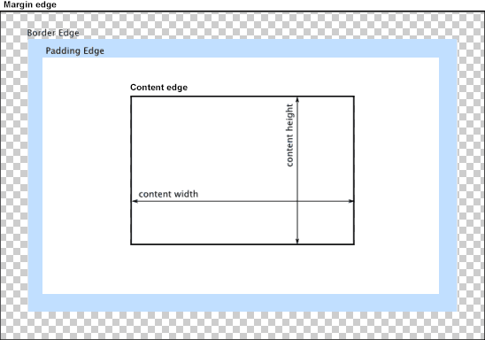

## CSS와 박스 모델

박스 모델이란 각 요소(element)는 사각형 박스 형태로 나타냅니다. 박스의 크기, 특성(색, 배경, 테두리 모양 등) 및 위치 결정이 렌더링 엔진의 목적입니다.

CSS에서, 이 사각형 박스 각각은 표준 박스 모델을 사용하여 기술됩니다. 이 모델은 요소에 의해 차지되는 공간의 내용(content)을 설명합니다. 각 박스는 네 경계(edge)가 있습니다: margin 경계, border 경계, padding 경계 및 content 경계.



`content 영역`은 요소의 실제 내용을 포함하는 영역입니다. 거기에는 대개 배경, 색 또는 이미지(그 순서로, 배경색을 감추는 불투명한 이미지)가 있고 content 경계 안쪽에 놓입니다. 따라서 그 크기(dimensions)는 content 너비 및 content 높이입니다.

`padding 영역`은 패딩을 둘러싼 보더까지 입니다. content 영역이 배경, 색 또는 그 위에 설정된 이미지가 있을 때, 이는 패딩까지 이어집니다. 이것이 패딩을 content의 연장으로 생각할 수 있는 이유입니다. 패딩은 padding 경계 안쪽에 놓이고 그 크기는 padding 박스 너비 및 padding 박스 높이입니다.

패딩과 content 경계 사이의 공간은 padding-top, padding-right, padding-bottom, padding-left 및 단축(shorthand) CSS 속성 padding으로 제어될 수 있습니다.

`border 영역`은 padding 영역을 보더를 포함하는 영역까지 확장합니다. 이는 border 경계 안쪽 영역이고 그 크기는 border-box 너비 및 border-box 높이입니다. 이 영역은 border-width 속성 또는 단축 border에 의해 정의된 보더의 크기에 의존합니다.

`margin 영역`은 border 영역을 요소를 그 이웃과 구별하기 위해 쓰이는 빈 영역으로 확장합니다. 이는 margin 경계 안쪽 영역이고 그 크기는 margin 박스 너비 및 margin 박스 높이입니다.

### 블록 레벨 요소와 인라인 레벨 요소

블록 레벨(block-level) 요소는 한줄을 모두 차지하는 요소입니다. 즉 너비를 100%를 갖고있어 요소의 왼쪽이나 오른쪽에 다른 요소가 올수 없습니다.

인라인 레벨(inline-level) 요소는 한줄을 차지하지 않는 요소입니다. 즉 한줄에 여러개의 인라인 레벨 요소가 표시될 수 있습니다.

<table class="table">
    <tr>
        <th>종류</th>
        <th>해당 태그</th>
    </tr>
    <tr>
        <td>블록 레벨 태그</td>
        <td>`<p>, <h1>~<h6>, <ul>, <ol>, <div>, <blockquote>, <form>, <hr>, <table>, <fieldset>, <address>`</td>
    </tr>
    <tr>
        <td>인라인 레벨 태그</td>
        <td>`, <object>, <br>, <sub>, <sup>, <span>, <input>, <textarea>, <label>, <button>`</td>
    </tr>
</table>

### width, height 속성 - 콘텐츠 영역의 크기

박스 모델에서 콘텐츠 영역의 크기를 지정할때 너비는 width 속성과 높이는 height 속성을 사용합니다.

```css
width: <크기> | <백분율> | auto
height: <크기> | <백분율> | auto
```

<table class="table">
    <tr>
        <th>속성 값</th>
        <th>설명</th>
    </tr>
    <tr>
        <td>크기</td>
        <td>너비나 높이값을 px나 cm 같은 단위와 함께 수치로 지정합니다.</td>
    </tr>
    <tr>
        <td>백분율</td>
        <td>박스 모델을 포함하는 부모 요소를 기준으로 너비나 높이 값을 백분율(%)로 지정합니다.</td>
    </tr>
    <tr>
        <td>auto</td>
        <td>박스 모델의 너비와 높이 값이 콘텐츠 양에 따라 자동으로 결정됩니다. 기본값</td>
    </tr>
</table>

* 실제 컨텐츠 크기 계산하기

너비를 나타내는 width 속성에 좌우 패딩과 테두리까지 합쳐야 실제 컨텐츠의 크기를 알수 있습니다.

```css
.ex {
    width: 200px; /* 너비 */
    height: 200px; /* 높이 */
    padding: 10px; /* 여백 */
    border: 5px solid #000; /* 테두리 */
    background: red; /* 보여주기위한 예제*/
}
```

<kdb>컨텐츠 크기(230) = 너비(200) + 좌우여백(20) + 좌우테두리(10)</kdb>

<div style="width:200px; height:200px; padding:10px; border:5px solid #000; background:red;"></div>

### display 속성 - 화면 배치 방법 결정하기

`display` 속성을 사용하면 블록레벨요소를 인라인 레벨 요소로 바꿀수도 있고, 여려형태로 사용할 수 있습니다.

```css
display: none | block | inline-block | inline | contents | table | table-cell 등
```


